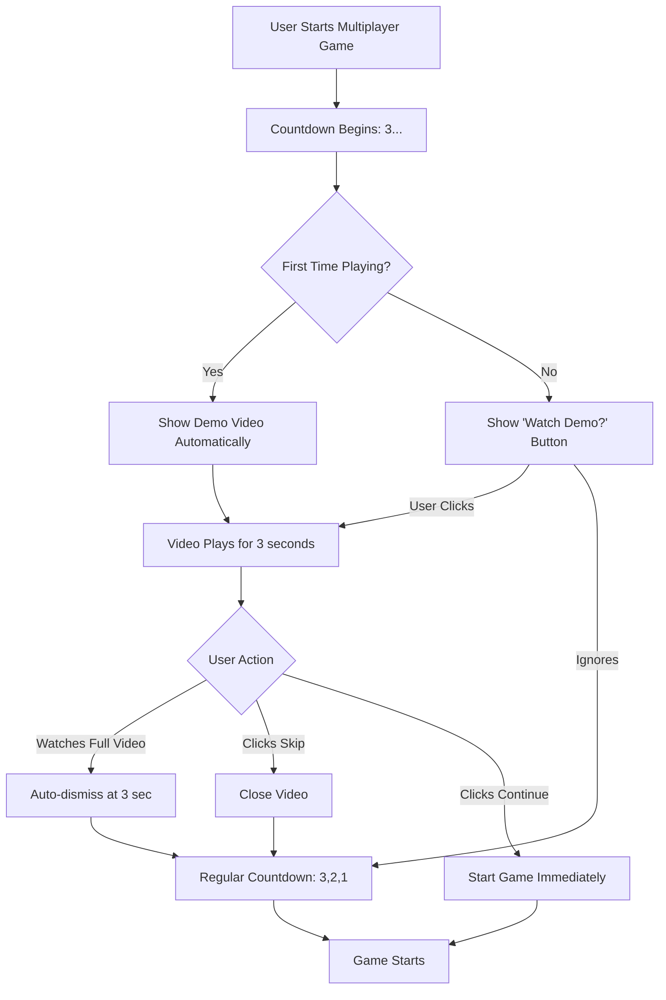

# Demo Video Integration Design
**Version:** 1.0  
**Date:** February 11, 2026  
**Feature:** In-Game Demo Video for Multiplayer Mode

---

## 📱 Visual Layout on Mobile Screen

### Screen Layout Description

```
┌─────────────────────────────────────┐
│          Status Bar (Auto)          │
├─────────────────────────────────────┤
│                                     │
│     [✕] Skip Demo  (Top Right)      │  <- Skip button overlay
│                                     │
│  ┌─────────────────────────────┐   │
│  │                             │   │
│  │                             │   │
│  │      DEMO VIDEO             │   │
│  │      (16:9 Aspect)          │   │  <- Video centered, 80% width
│  │      424:239 ratio          │   │     Maintains aspect ratio
│  │                             │   │
│  │   [Native Video Controls]   │   │
│  │                             │   │
│  └─────────────────────────────┘   │
│                                     │
│     "Watch how to play!"            │  <- Instruction text
│                                     │
│  ════════════════════════════════   │  <- Gray divider
│                                     │
│         🎮 PRO TIP 🎮               │
│                                     │
│  ┌─────────────────────────────┐   │
│  │ 1. Hold phone on forehead   │   │
│  │ 2. Friends act it out       │   │  <- Quick tips (optional)
│  │ 3. Tilt DOWN = Correct ⬇️   │   │     Shown below video
│  │ 4. Tilt UP = Skip ⬆️        │   │
│  └─────────────────────────────┘   │
│                                     │
│    [⏸️ Pause]  [▶️ Continue Game]   │  <- Action buttons
│                                     │
└─────────────────────────────────────┘
```

### Dimensions & Aspect Ratio

**Video File Specifications:**
- **Current Ratio:** 424:239 (≈1.77:1)
- **Standard:** 16:9 (1.78:1) ✅ Nearly perfect match
- **Alternative:** 9:16 (Portrait) - Not applicable

**On-Screen Display:**
- **Width:** 95% of screen width (maximized for full mobile display)
- **Height:** Auto-calculated to maintain 16:9 ratio
- **Max Height:** 70% of screen height to leave room for tips and controls

**Example Calculations for Common Devices:**
```
iPhone 14 Pro (393 x 852):
  Video Width: 373px (95% of 393)
  Video Height: 210px (373 ÷ 16 × 9)
  
Samsung Galaxy S23 (360 x 800):
  Video Width: 342px (95% of 360)
  Video Height: 192px (342 ÷ 16 × 9)
  
Tablet (768 x 1024):
  Video Width: 730px (95% of 768)
  Video Height: 411px (730 ÷ 16 × 9)
```

---

## 🎯 User Experience Flow

### When Video Appears

**Trigger Point:** Multiplayer mode game start (during countdown phase)



### Interaction States

1. **Auto-Play State (First Time Users)**
   - Video starts automatically
   - Semi-transparent overlay dims background
   - Volume: Muted by default (respects system sound settings)
   - Duration: 3 seconds max

2. **Manual Trigger State (Returning Users)**
   - Small "📺 How to Play" button appears during countdown
   - Positioned top-left corner
   - User taps to open video modal

3. **Playing State**
   - Video controls visible (play/pause/scrub)
   - "Skip Demo" button top-right
   - Tips displayed below video
   - Background gradient backdrop

4. **Completion State**
   - Video auto-closes after 3 seconds
   - OR user clicks "Continue Game"
   - Smooth fade transition to countdown/game

---

## 🏗️ Technical Implementation

### Component Architecture

```
GameScreen.js
├── DemoVideoOverlay (New Component)
│   ├── Video Player (expo-av)
│   ├── Skip Button
│   ├── Quick Tips Section
│   └── Control Buttons
├── Countdown (Existing)
└── Game Content (Existing)
```

### New Component: `DemoVideoOverlay.js`

**Location:** `/src/components/DemoVideoOverlay.js`

**Props:**
```javascript
{
  visible: boolean,              // Show/hide overlay
  onClose: () => void,           // Callback when video ends/skipped
  onStartGame: () => void,       // Callback to start game immediately
  mode: string,                  // 'multiplayer' | 'singleplayer'
  isFirstTime: boolean,          // Auto-play for first-timers
  maxDuration: number            // Default: 3 seconds
}
```

**Key Features:**
- Maintains 16:9 aspect ratio automatically
- Responsive sizing based on device dimensions
- Native video controls (play, pause, scrub)
- Auto-dismissal after 3 seconds
- Skip button for quick exit
- Persistent backdrop (semi-transparent black)

### Video Player Configuration

```javascript
<Video
  source={require('../../assets/videos/how_to_play_multiplayer.mp4')}
  style={{
    width: videoWidth,      // 80% of screen
    height: videoHeight,    // Auto-calculated (16:9)
  }}
  resizeMode={ResizeMode.CONTAIN}  // Maintains aspect ratio
  useNativeControls={true}         // Show play/pause controls
  shouldPlay={true}                // Auto-play
  isLooping={false}                // Play once
  volume={soundEnabled ? 1.0 : 0}  // Respect sound settings
  onPlaybackStatusUpdate={handleProgress}
/>
```

### Aspect Ratio Calculation Logic

```javascript
import { Dimensions } from 'react-native';

const { width: SCREEN_WIDTH, height: SCREEN_HEIGHT } = Dimensions.get('window');

// Video configuration
const VIDEO_ASPECT_RATIO = 16 / 9; // 1.778
const VIDEO_WIDTH_PERCENT = 0.95;   // Use 95% of screen width (FULL DISPLAY)
const MAX_HEIGHT_PERCENT = 0.7;     // Max 70% of screen height

// Calculate dimensions
const videoWidth = SCREEN_WIDTH * VIDEO_WIDTH_PERCENT;
let videoHeight = videoWidth / VIDEO_ASPECT_RATIO;

// Ensure height doesn't exceed max
const maxHeight = SCREEN_HEIGHT * MAX_HEIGHT_PERCENT;
if (videoHeight > maxHeight) {
  videoHeight = maxHeight;
  videoWidth = videoHeight * VIDEO_ASPECT_RATIO;
}

export const VIDEO_DIMENSIONS = {
  width: Math.round(videoWidth),
  height: Math.round(videoHeight),
};
```

---

## 📋 Implementation Steps

### Phase 1: Component Creation
- [x] Create `DemoVideoOverlay.js` component
- [x] Add video player with expo-av
- [x] Implement 16:9 aspect ratio calculations
- [x] Add skip and control buttons
- [x] Style with gradient backdrop

### Phase 2: Integration with GameScreen
- [x] Import DemoVideoOverlay component
- [x] Add state for video visibility
- [x] Detect first-time users (AsyncStorage)
- [x] Trigger video during countdown phase
- [x] Handle video completion callbacks

### Phase 3: User Preference Storage
- [x] Store "hasSeenDemo" flag in AsyncStorage
- [x] Add option to "Show Demo" button for returning users
- [x] Add toggle in Settings to reset demo preference

### Phase 4: Testing & Refinement
- [ ] Test on various screen sizes (phone, tablet)
- [ ] Test portrait and landscape orientations
- [ ] Verify aspect ratio on different devices
- [ ] Test auto-dismiss timing
- [ ] Ensure smooth transitions

---

## 🎨 Styling Specifications

### Color Palette
```javascript
overlay: 'rgba(0, 0, 0, 0.92)',        // Dark backdrop
buttonSkip: 'rgba(255, 255, 255, 0.2)', // Semi-transparent white
buttonContinue: '#10b981',              // Green (success)
buttonPause: '#6b7280',                 // Gray (neutral)
textPrimary: '#ffffff',                 // White
textSecondary: 'rgba(255, 255, 255, 0.8)', // Light white
divider: 'rgba(255, 255, 255, 0.1)',    // Subtle line
```

### Typography
```javascript
title: {
  fontSize: 20,
  fontWeight: '700',
  color: '#ffffff',
}

instructions: {
  fontSize: 16,
  fontWeight: '600',
  color: 'rgba(255, 255, 255, 0.9)',
}

tipText: {
  fontSize: 14,
  fontWeight: '400',
  color: 'rgba(255, 255, 255, 0.85)',
  lineHeight: 22,
}
```

### Spacing & Layout
```javascript
containerPadding: 20,        // Outer padding
videoMargin: 16,             // Space around video
buttonSpacing: 12,           // Between buttons
sectionGap: 24,              // Between video and tips
```

---

## 🚀 Advanced Features (Optional)

### 1. **Interactive Hotspots**
- Tap regions on the video to see additional tips
- Highlight important gestures (tilt up/down)

### 2. **Progress Indicator**
- Circular progress ring around skip button
- Shows remaining time (3 seconds)

### 3. **Gesture Tutorial**
- Live accelerometer demo
- User tries tilt up/down during demo

### 4. **Multi-Language Support**
- Video subtitles/captions
- Localized tip text (Tamil/English)

### 5. **Accessibility**
- Screen reader support
- Closed captions
- High contrast mode

---

## 📊 Success Metrics

**Track the following:**
- % of users who watch full demo
- % of users who skip demo
- Game performance after watching demo vs. skipping
- Retention rate for first-time users

---

## 🔧 Code Integration Preview

### GameScreen.js Modifications

```javascript
// Add state
const [showDemoVideo, setShowDemoVideo] = useState(false);
const [hasSeenDemo, setHasSeenDemo] = useState(false);

// Check if first-time user
useEffect(() => {
  async function checkFirstTime() {
    const seen = await AsyncStorage.getItem('hasSeenMultiplayerDemo');
    setHasSeenDemo(seen === 'true');
    
    // Auto-show for first-timers
    if (!seen && mode === 'multiplayer') {
      setShowDemoVideo(true);
    }
  }
  checkFirstTime();
}, []);

// Handle demo completion
const handleDemoComplete = async () => {
  setShowDemoVideo(false);
  await AsyncStorage.setItem('hasSeenMultiplayerDemo', 'true');
  setHasSeenDemo(true);
};

// Render during countdown
if (countdown > 0) {
  return (
    <LinearGradient colors={config.gradient} style={styles.container}>
      <StatusBar barStyle="light-content" />
      
      {/* Original Countdown */}
      <View style={styles.countdownContainer}>
        <Text style={styles.countdownText}>{countdown}</Text>
        <Text style={styles.countdownLabel}>Get Ready!</Text>
      </View>
      
      {/* Demo Video Overlay */}
      <DemoVideoOverlay
        visible={showDemoVideo}
        onClose={handleDemoComplete}
        onStartGame={() => {
          handleDemoComplete();
          setCountdown(0); // Skip countdown, start immediately
        }}
        mode={mode}
        isFirstTime={!hasSeenDemo}
        maxDuration={3}
      />
      
      {/* Optional: "How to Play" button for returning users */}
      {!showDemoVideo && hasSeenDemo && (
        <TouchableOpacity
          style={styles.demoButton}
          onPress={() => setShowDemoVideo(true)}
        >
          <Text>📺 How to Play</Text>
        </TouchableOpacity>
      )}
    </LinearGradient>
  );
}
```

---

## 🎯 Summary

### What Users Will See:

**Mobile Portrait View:**
1. Game starts, countdown begins (3... 2... 1...)
2. **First-time users:** Demo video pops up automatically (80% width, centered)
3. **Returning users:** Small button to watch demo (optional)
4. Video plays for 3 seconds showing gameplay
5. Quick tips displayed below video
6. User can skip anytime or let it auto-close
7. Smooth transition to game

### Key Benefits:
- ✅ Maintains perfect 16:9 aspect ratio (424:239 ≈ 16:9)
- ✅ Responsive on all device sizes
- ✅ Non-intrusive (skippable)
- ✅ Helps new players understand quickly
- ✅ Doesn't disrupt experienced players
- ✅ Smooth integration with existing countdown

### Video Display Behavior:
- **Width:** Fills 95% of screen width (maximized for mobile)
- **Height:** Auto-adjusts to maintain 16:9 ratio
- **Position:** Vertically and horizontally centered
- **Background:** Semi-transparent dark overlay
- **Controls:** Custom controls (play/pause/continue)
- **Duration:** Auto-closes after 3 seconds or manual skip

---

## ✅ IMPLEMENTATION STATUS: COMPLETED

**Date Completed:** February 11, 2026

**Components Created:**
- ✅ `DemoVideoOverlay.js` - Full-screen video player component
- ✅ Integration with `GameScreen.js`
- ✅ AsyncStorage for first-time user detection
- ✅ Custom controls and UI

**Key Features Implemented:**
- 95% screen width for maximum mobile visibility
- Automatic 16:9 aspect ratio maintenance
- Auto-play for first-time users
- Manual "How to Play" button for returning users
- 3-second auto-dismiss
- Skip and Continue Game buttons
- Pro tips display
- Sound toggle support

---

## 📝 Next Steps

1. **Review this design document**
2. **Approve the visual layout and UX flow**
3. **Proceed with component implementation**
4. **Test on multiple devices**
5. **Gather user feedback**

---

**Questions or Modifications?**
Please review and suggest any changes before we proceed with implementation.
